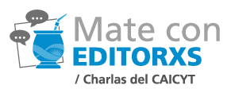

- **Mayo:** martes 14
- **Horario:** 11 hs
- **Temario:** generación de múltiples formatos (PDF, ePub, DOCX y XML-JATS) para publicaciones académicas en un único proceso.
- **Invitado especial:** Alberto Moyano, editor especializado en textos académicos y científicos, director editorial de Ediciones Imago Mundi.
- Presentación del logo ARK-CAICYT
- Espacio final para comentarios y pregunta

Se puede acceder al video de la charla ![desde acá]{https://www.youtube.com/watch?v=4c4hpXzGecM}.

